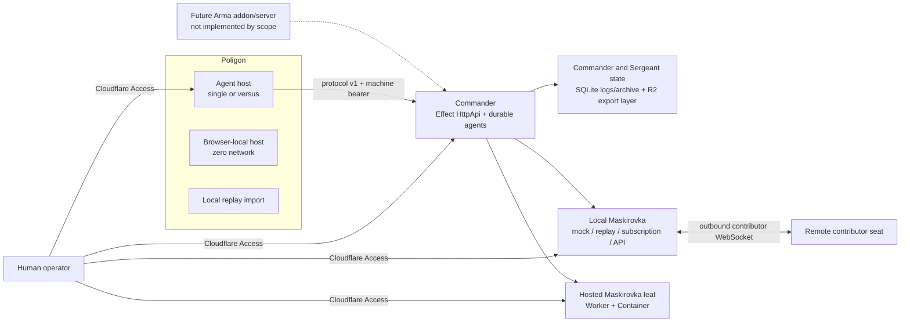

# Stavka operator guide

This guide covers every layer that can be run or prepared from this repository
without Arma Reforger. Cloudflare deployment, Access policy creation, live
provider accounts, the production addon, and a dedicated server are explicit
external gates; no result for those gates is claimed here.

## System shape



The boundaries are deliberately separate:

- simulator/game traffic uses an opaque machine bearer on Commander `/api/*`;
- local/hosted Maskirovka model traffic uses its own seat bearer;
- contributor processes connect outbound to Commander `/seats` with a
  registration bearer;
- human pages, admin APIs, and Agent WebSocket upgrades use Cloudflare Access;
- exact local mode may synthesize a development identity only when both
  `ENVIRONMENT=local` and `DEV_ACCESS_EMAIL` are configured.

An Access identity never substitutes for a model/game machine credential.

## Prerequisites and bootstrap

Use the pinned workspace versions:

- Node.js 22 from `.node-version`
- pnpm 11.18.0 from `package.json`
- Vite+ 0.2.7 from the root development dependencies
- Docker only for the hosted-seat Linux image build

```bash
corepack enable
pnpm install --frozen-lockfile
pnpm exec vp --version
```

CI installs with a frozen lockfile. Do not switch package managers or modify the
lock merely because `vp` is not installed globally.

## Deterministic local Commander and Poligon

Create ignored local files from the tracked templates:

```bash
cp apps/commander/.dev.vars.example apps/commander/.dev.vars
cp apps/poligon/.dev.vars.example apps/poligon/.dev.vars
```

The examples intentionally use:

| App       | Setting                                    | Purpose                                                 |
| --------- | ------------------------------------------ | ------------------------------------------------------- |
| Commander | `API_KEY`                                  | Machine key required on `/api/*`; it must match Poligon |
| Commander | `STAVKA_AI_PROVIDER=mock`                  | Deterministic bounded rule planning, no provider        |
| Commander | `STAVKA_AI_BASE_URL=http://127.0.0.1:4141` | Maskirovka origin for an explicitly enabled model run   |
| Commander | `STAVKA_AI_KEY`                            | Separate Maskirovka bearer; the example is local-only   |
| Poligon   | `COMMANDER_URL=http://127.0.0.1:8787`      | Commander origin                                        |
| Poligon   | `COMMANDER_API_KEY`                        | Exact match for Commander `API_KEY`                     |
| Both      | `ENVIRONMENT=local`, `DEV_ACCESS_EMAIL`    | Exact-local synthetic human identity                    |

Do not use root `pnpm dev` for this smoke: it starts every matching development
task. Run the apps in separate terminals:

```bash
pnpm --filter @stavka/commander dev
```

```bash
pnpm --filter @stavka/poligon dev
```

Commander normally binds `http://127.0.0.1:8787`; Poligon prints the selected
Vite port. The Agent-hosted acceptance path is:

1. Open Poligon and keep `host=agent`.
2. Step once and observe connect, terrain upload, a full tick, and Commander
   status.
3. Resume at ×10 and confirm a decision produces a bounded command and later a
   terminal command result.
4. Reload the same URL and confirm the scenario identity and link checkpoint.
5. Restart Commander and confirm the link requests a full snapshot instead of
   applying a stale delta.

Health and machine-auth checks:

```bash
curl --fail http://127.0.0.1:8787/healthz

stavka_poligon_origin=http://127.0.0.1:5173
curl --fail "${stavka_poligon_origin}/healthz"

curl --silent --output /dev/null --write-out '%{http_code}\n' \
  --request POST http://127.0.0.1:8787/api/tick
```

Use the actual Poligon origin printed by Vite. The final command must return
`401`.

### Poligon selectors

Poligon validates its search state with Effect Schema:

| Query        | Values                                          | Effect                                                  |
| ------------ | ----------------------------------------------- | ------------------------------------------------------- |
| `scenario`   | `movement`, `engagement`, `mechanized`          | Deterministic world fixture                             |
| `seed`       | integer; the UI limits entry to 1–2,147,483,647 | Simulation randomness                                   |
| `time_scale` | `1`, `10`, `100`                                | Hosted/offline cadence and Agent identity               |
| `camera`     | `ortho`, `perspective`                          | Viewer only; does not change Agent identity             |
| `doctrine`   | `balanced`, `aggressive`, `defensive`           | Commander prompt/rule doctrine                          |
| `mode`       | `single`, `versus`                              | One Commander or isolated OPFOR and BLUFOR Commanders   |
| `host`       | `agent`, `offline`                              | Durable Agent/Commander loop or browser-only simulation |

Every simulation-affecting selector is part of the Agent identity. Commander
session identity also includes faction. In `mode=versus`, confirm both factions
connect, receive only faction-relative information, and cannot mutate the other
faction's groups.

### Zero-network browser host

Open Poligon with `?host=offline` to run `sim-core` directly in the browser. It
uses the same fixed 100 ms world and deterministic seed/restore behavior but
creates no Agent or Commander state and must not fetch or open a WebSocket.
Offline mode is for simulation/UI work, not Commander acceptance.

### Replay and cost views

Agent-hosted sessions show current Commander usage grouped by faction, agent
tier, and model. The table reports calls, input/output tokens, and USD cost from
the canonical Commander status; a mock/rule run truthfully reports no model
usage.

Open `/replay` and choose a local JSON `SessionExport`. The browser rejects
oversized, invalid JSON, excess-property, and schema-invalid files before
rendering. Nothing is uploaded and remote URLs are not accepted. The view joins
archived results into a cause → decision → commands → outcomes timeline and
shows the export's grouped costs.

## Commander surface and behavior

Commander uses Effect v4 `HttpApi` for its typed contracts and Effect
`HttpRouter` for Agent/seat upgrades and fallbacks. `/openapi.json` is generated
from the same contract. There is no Hono or manual pathname dispatcher.

| Route                         | Auth                     | Purpose                                                   |
| ----------------------------- | ------------------------ | --------------------------------------------------------- |
| `GET /healthz`                | none                     | Liveness, protocol version, configured AI aliases         |
| `GET /openapi.json`           | none                     | Contract-generated OpenAPI document                       |
| `POST /api/connect`           | game/simulator bearer    | Start or reconnect a session and request full state       |
| `POST /api/tick`              | game/simulator bearer    | Apply a strict full/delta tick and return commands/status |
| `POST /api/disconnect`        | game/simulator bearer    | Mark the session disconnected                             |
| `POST /api/map`               | game/simulator bearer    | Validate/cache/apply a terrain briefing                   |
| `GET /admin/session`          | Access read              | Inspect one session/faction/epoch                         |
| `GET /admin/logs`             | Access read              | Read bounded recent decision logs                         |
| `GET /admin/seats`            | Access read              | List registered seat metadata and health                  |
| `POST /admin/seats`           | Access admin             | Register a seat                                           |
| `DELETE /admin/seats/:seatId` | Access admin             | Remove a seat                                             |
| `GET /admin/export`           | Access admin             | Download a canonical bounded inline `SessionExport`       |
| `POST /admin/exports`         | Access admin             | Page the complete session archive into R2                 |
| `GET /admin/exports`          | Access read              | List matching R2 export metadata                          |
| `GET /admin/exports/object`   | Access read              | Read and verify one canonical R2 export by object key     |
| `/agents/*`                   | Access read              | Agents SDK HTTP/WebSocket routing                         |
| `GET /seats`                  | seat registration bearer | Contributor WebSocket registration/job channel            |

Admin session/log/export routes take `session_id`, `faction`, and optional
`epoch` query parameters. `POST /admin/exports` also accepts an optional
`export_id`; the list accepts `limit`; object reads take the opaque `key`
returned by persistence/listing. Service-token permissions default to read; an
operator may explicitly add `operate` or `admin` through
`ACCESS_AUTOMATION_PERMISSIONS`. Keep service tokens least-privileged.

Provider calls are never awaited by `/api/tick`. A tick schedules/coalesces
durable strategic work, queues bounded per-report Sergeant assessments, and
incorporates completed/acknowledged results on later ticks. Accepted commands
remain pending until one terminal result, so resource/cost reconciliation is
idempotent. Contributor jobs, reservations, connection fencing, and results are
durable and deterministic across reconnect handling.

The inline export intentionally stays bounded for an interactive response.
`POST /admin/exports` instead counts and pages all Commander SQLite log/archive
rows, writes content-addressed page objects, and publishes a digest-checked root
manifest only after every page succeeds. List/read operations reconstruct the
canonical `SessionExport` behind the repository boundary. The binding is
`SESSION_EXPORTS` (`stavka-session-exports`); configured source is not proof
that the target-account bucket, retention/garbage collection, or deployed
read/write behavior is correct.

## Local Maskirovka gateway

Maskirovka keeps ordinary development deterministic and makes seat use an
explicit operator action.

```bash
pnpm ai:doctor
pnpm ai:up
pnpm ai:smoke
pnpm ai:models
pnpm ai:serve
```

- `ai:up` runs the non-billing doctor, writes only Maskirovka-owned values into
  ignored development files, builds the dashboard, and starts on
  `127.0.0.1:4141` by default.
- `ai:smoke` exercises health, model discovery, Responses, and Messages with an
  in-memory mock and no provider request.
- `ai:models` prints alias-to-seat/model resolution.
- `ai:serve` requires `MASKIROVKA_SEAT_KEY` (or `--key`) and is the explicitly
  authenticated server posture.
- `doctor --live` is the only doctor mode that may run a credit-consuming ping;
  `--no-write` inspects without updating ignored files.

The contract-first server exposes:

| Route                                                                        | Auth                           | Purpose                                         |
| ---------------------------------------------------------------------------- | ------------------------------ | ----------------------------------------------- |
| `GET /healthz`                                                               | none                           | Alias, seat, headroom, savings, and mode status |
| `GET /v1/models`                                                             | none                           | Tier aliases and current resolution             |
| `POST /v1/responses`                                                         | bearer when configured         | Current OpenAI Responses dialect only           |
| `POST /v1/messages`                                                          | bearer when configured         | Current Anthropic Messages dialect only         |
| `GET /_/` and assets                                                         | Access (exact-local exception) | TanStack operations SPA                         |
| `/admin/status`, `/admin/requests`, `/admin/aliases/*`, `/admin/kill-switch` | machine bearer or Access role  | Request feed and routing controls               |

Chat Completions is deliberately unsupported. The dashboard and assets remain
router-managed and Access-checked; `ENVIRONMENT` missing or misspelled fails to
production posture.

### Modes, routing, and accounting

- `live` bypasses cache.
- `record` writes canonical content-addressed responses.
- `replay` fails on a corpus miss and never invokes a seat. CI/eval uses this
  posture; the tracked corpus covers Responses and Messages.
- Candidate seats must be checked and healthy. Retryable failures advance
  through a bounded priority sequence; invalid semantic output does not get
  retried as if it were transport failure.
- Fair per-seat governors bound active/queued work.
- Repository-backed headroom atomically reserves, reconciles, or refunds
  estimated in-flight usage. Reported usage on failed/invalid results is still
  counted. Plan credit, metered cash, API-list equivalent, and estimated savings
  remain separate.

Do not infer entitlement, model availability, quota, or billing from a doctor,
mock, or replay pass.

### Outbound contributor seat

A machine behind NAT can contribute an authenticated Claude or Codex seat by
opening an outbound WebSocket to Commander:

```bash
MASKIROVKA_CLAUDE_MONTHLY_CREDIT_USD=20 \
  pnpm --filter @stavka/maskirovka serve -- \
  --register wss://commander.example/seats \
  --token '<registration-token>' \
  --provider claude \
  --seat-id home-claude
```

Contributor mode owns bearer registration, heartbeat/reconnect, typed decision
frames, deadlines, cancellation, official SDK execution, and durable per-seat
usage reservations. It is a leaf process: it does not start the local HTTP
gateway, dashboard, request feed, cache, or alias controls. Commander owns
cross-seat aggregation and failover.

## Hosted Maskirovka leaf

`apps/maskirovka-seat` is a single operator-owned seat, not a replacement for
the local orchestration gateway. Its Worker and Container both use Effect v4
`HttpApi`; the Container runs one official Codex or Claude SDK.

Repository-only checks:

```bash
pnpm --filter @stavka/maskirovka-seat typecheck
pnpm --filter @stavka/maskirovka-seat test
pnpm --filter @stavka/maskirovka-seat build
pnpm --filter @stavka/maskirovka-seat build:container
```

The first three use fakes/dry-run bundles. The Docker build proves image shape,
not provider login or Cloudflare lifecycle.

Every machine route, including `/healthz` and `/v1/models`, requires the
`Authorization: Bearer <MASKIROVKA_SEAT_KEY>` header. This also applies to
current-dialect generation routes and authenticated not-found handling. The
seat runs only the dialect matching its provider; Chat Completions is rejected.
One invocation is active, up to eight wait FIFO, excess work receives
backpressure, and an aborted waiter is removed.

Human routes are different:

| Route                         | Access permission | Purpose                                                              |
| ----------------------------- | ----------------- | -------------------------------------------------------------------- |
| `GET /_/` and assets          | read              | Static TanStack operations SPA; every asset fetch re-verifies Access |
| `GET /admin/status`           | read              | Leaf/container/auth/control capability status                        |
| `GET /admin/requests?limit=…` | read              | Up to 200 metadata-only request rows                                 |
| `PUT /admin/aliases/:alias`   | admin             | Remap an already configured alias to a concrete model on this leaf   |
| `POST /admin/kill-switch`     | admin             | Persistently stop/restore new traffic on this leaf                   |

Service-token automation is read-only. The request log stores generated ID,
timestamp, dialect, alias/model, status, latency, and queue depth—never prompt,
body, caller auth, or provider error text. Registry management, cross-seat
routing/fallback, and shared budget controls remain orchestration-gateway
responsibilities and are truthfully absent from the leaf UI.

Configure exactly one provider credential per deployment:

```bash
pnpm --filter @stavka/maskirovka-seat exec wrangler secret put MASKIROVKA_SEAT_KEY
pnpm --filter @stavka/maskirovka-seat exec wrangler secret put CODEX_ACCESS_TOKEN
```

Use `CLAUDE_CODE_OAUTH_TOKEN` instead for a Claude deployment. Do not set
`OPENAI_API_KEY`, `CODEX_API_KEY`, or `ANTHROPIC_API_KEY` on a subscription
seat; those variables can silently change the billing/auth posture. The
checkpoint code persists only observed post-bootstrap credential rotation and
binds it to the injected-secret fingerprint; actual SDK token-rotation behavior
still needs live external observation.

## Workspace commands

Run these from the repository root:

| Command                 | Scope                                                          |
| ----------------------- | -------------------------------------------------------------- |
| `pnpm check`            | Vite+ lint/format gate                                         |
| `pnpm lint:tailwind`    | Oxc + `better-tailwindcss`, warnings denied                    |
| `pnpm test`             | Deterministic Vitest suite                                     |
| `pnpm test:watch`       | Interactive watch mode                                         |
| `pnpm typecheck`        | TypeScript checks across workspaces                            |
| `pnpm build`            | Package builds and Worker dry-run bundles, concurrency limited |
| `pnpm verify`           | Workspace-declared verification tasks, concurrency limited     |
| `pnpm eval -- --replay` | Semantic replay/simulation/Maskirovka corpus gate              |
| `pnpm ai:smoke`         | Zero-provider local gateway contract smoke                     |
| `pnpm generate-key`     | Print a new 256-bit `sk-stavka-…` machine key                  |

Tailwind warnings seen by Cursor are intentional project diagnostics. Four Oxc
invocations select the correct CSS entrypoint for shared UI, Poligon, local
Maskirovka, and the hosted seat; together they cover the first-party JS/TS
surfaces with warnings denied. The tracked workspace settings teach Tailwind
IntelliSense about `tv(...)`, `cn(...)`, and those v4 style sources. Do not
silence a warning with hand-built conditional class strings.

There is no root deploy command. Deploy an app only after external setup, using
its workspace `deploy` script. Never publish merely because a dry run passed.

## Secrets and deployment preparation

Local rules:

- keep `.dev.vars` and `.maskirovka` state untracked;
- use mock/replay unless the run is explicitly about a live provider;
- route Commander model traffic through Maskirovka, never directly to a
  provider origin;
- keep game, Maskirovka, contributor-registration, Access, and provider
  credentials distinct;
- never place real credentials in examples, fixtures, replay corpora, command
  arguments, screenshots, or chat.

Once an operator supplies a Cloudflare account/domain, the safe preparation
sequence is:

1. Complete all deterministic and local HTTP/browser gates.
2. Confirm the intended account with `wrangler whoami` in each app directory.
3. Create/bind Commander DO/KV/R2, Poligon Agent assets, and hosted-seat
   DO/Container/assets; replace placeholder origins.
4. Add secrets interactively with `wrangler secret put`.
5. Create Access applications and policies; configure exact team domains,
   audiences, user roles, and least-privilege service tokens.
6. Deploy deliberately, then verify unauthorized and authorized HTTP,
   WebSocket, state eviction/redeploy, R2 export, Container lifecycle,
   cancellation/backpressure, and secret rotation.
7. Validate each live seat separately before enabling Commander routing; keep
   rule/replay fallback available.
8. Record observability, failure/degraded-mode, retention, rollback, and cost
   evidence.

Those steps are instructions for a future authorized deployment, not evidence
that one occurred.

## Arma and dedicated-server handoff — excluded by scope

`mods/StavkaTest` preserves historical Workbench experiments. It is not the
production shared/Commander addon described by `PRODUCT.md`, and its legacy
round-trip harness is not protocol-v1 product evidence.

When Windows, Arma Reforger Tools, and a target server are available, a separate
implementation/acceptance effort must build and compile the production addon,
exercise protocol-v1 connect/full/delta/config/results/disconnect/resync,
extract server-authoritative state/events with fog boundaries, execute native
orders, keep keys server-only, validate Conflict/multiplayer/JIP/BattlEye, and
profile 30/40/50 groups. Packaging, Workshop dependencies, upgrade, and rollback
belong to that later server runbook.

Until then, both production mod and dedicated-server status remain excluded by
scope and unvalidated.

## Troubleshooting

- `vp: command not found`: run `pnpm install --frozen-lockfile`, then use
  package scripts or `pnpm exec vp`.
- Commander `503 MISCONFIGURED`: `API_KEY` or another required binding is
  missing.
- Commander `401 UNAUTHORIZED`: Poligon and Commander machine keys do not
  match.
- Local human route `401 ACCESS_REQUIRED`: both `ENVIRONMENT=local` and
  `DEV_ACCESS_EMAIL` must exist in that app's ignored config.
- Poligon Commander offline: verify Commander URL/key/health, then inspect the
  decision feed for the exact link error.
- Poligon `host=offline` has no Commander: expected; offline mode deliberately
  disables Agent and network clients.
- Maskirovka result is `degraded` or a seat is `unchecked`: inspect health,
  doctor output, request metadata, and Commander decision logs; do not inject a
  provider key as a shortcut.
- Replay import rejected: use the canonical `SessionExport` JSON and keep it
  within the displayed file-size limit.
- Hosted dashboard is read-only: the Access identity lacks admin permission;
  service-token automation is deliberately read-only.
- Hosted model route `401`: supply the seat bearer; Access cookies do not
  authorize machine endpoints.

See [implementation and acceptance status](IMPLEMENTATION_STATUS.md) for the
final-gate table and external acceptance boundary.
