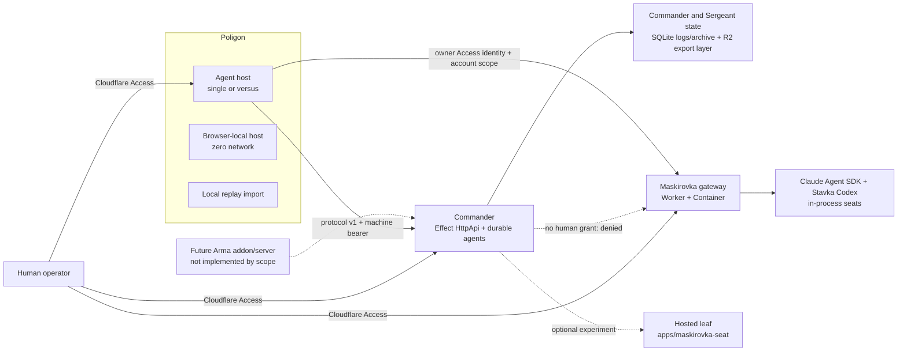

# Stavka operator guide

Primary day-to-day path is four Cloudflare services — the Maskirovka gateway
Container, hosted Maskirovka seat, Commander, and Poligon — via `wrangler dev`
locally or the CI-gated production workflow. Arma Reforger remains out of scope
here. Live subscription tokens and Cloudflare Access policies are operator-owned
gates.

**Permanently unsupported:** PRODUCT Posture B / home-Mac dial-in (outbound
contributor seats from a personal machine). Seat execution for hosted Stavka is
Cloudflare Container only. Do not wire or document dial-in to a personal Mac.

## System shape



The boundaries are deliberately separate:

- simulator/game traffic uses an opaque machine bearer on Commander `/api/*`;
- Maskirovka health/model metadata may use `MASKIROVKA_GATEWAY_KEY`; Codex and
  Claude execution requires the verified owner Access identity and that
  owner's active provider-account scope;
- human pages, admin APIs, and Agent WebSocket upgrades use Cloudflare Access;
- exact local mode may synthesize a development identity only when both
  `ENVIRONMENT=local` and `DEV_ACCESS_EMAIL` are configured.

An inference machine credential never substitutes for a human account grant.
Commander can call deterministic paths through its service binding, but cannot
use a user's provider subscription without an explicitly propagated human grant.

## Primary path: four Cloudflare services

| Service                | Workspace                    | Local                        | Production order |
| ---------------------- | ---------------------------- | ---------------------------- | ---------------- |
| Maskirovka gateway     | `@stavka/maskirovka-gateway` | `build:dashboard` then `dev` | 1                |
| Hosted Maskirovka seat | `@stavka/maskirovka-seat`    | `build:dashboard` then `dev` | 2                |
| Commander              | `@stavka/commander`          | `dev`                        | 3                |
| Poligon                | `@stavka/poligon`            | `dev` (Vite)                 | 4                |

Deploy and local origins, path maps, Access issuer pattern, and probe commands
are catalogued in [URLS.md](./URLS.md). Production workers.dev subdomain on
this account is `andrii-shafar`:

- Gateway: `https://stavka-maskirovka-gateway.andrii-shafar.workers.dev`
- Hosted seat: `https://stavka-maskirovka-seat.andrii-shafar.workers.dev`
- Commander: `https://stavka-commander.andrii-shafar.workers.dev`
- Poligon: `https://stavka-poligon.andrii-shafar.workers.dev`

The production workflow runs `pnpm run deploy:production` after all verification
gates. Its Effect task builds gateway and seat dashboards plus Poligon before
any mutation, then deploys the four services in the order in the table above.
For an explicit local/manual action, use the service's `pnpm --filter <pkg> run
deploy` script (never bare `pnpm deploy`, which is pnpm's own publish command).
Poligon deploy reads `dist/server/wrangler.json` from the preceding build.

### Production CI/CD policy

The single `.github/workflows/ci.yml` workflow verifies pull requests, pushes to
`main`, and manual dispatches. Its `deploy` job needs a successful `verify` job
and runs only for a `main` push or manual dispatch from `main`. It uses the
GitHub `production` environment, the non-cancellable `cloudflare-production`
concurrency group, and requires `CLOUDFLARE_API_TOKEN` plus
`CLOUDFLARE_ACCOUNT_ID`.

The account-scoped token should have Workers Scripts Edit and Containers Edit.
Add KV, R2, or route permissions only if a future CI task provisions or manages
those resources. Worker secrets and Claude/Codex provider credentials remain
out of band; CI never writes them.

A green deployment proves upload and Wrangler configuration only. While this
account's workers.dev origin returns Cloudflare `error code: 1042`, it does not
prove worker HTTP availability and the pipeline does not run a post-deploy
health check.

If a live rollback is required, run these package-filtered Wrangler commands in
reverse-dependency order (Poligon, Commander, hosted seat, then gateway):

```bash
pnpm --filter @stavka/poligon exec wrangler rollback -c wrangler.jsonc
pnpm --filter @stavka/commander exec wrangler rollback
pnpm --filter @stavka/maskirovka-seat exec wrangler rollback
pnpm --filter @stavka/maskirovka-gateway exec wrangler rollback
```

Each command accepts an optional positional `<VERSION_ID>` after `rollback` to
target a specific Worker Version. Rollback is an explicit operator live action,
never a repository verification step.

### Local wrangler-dev stack

```bash
corepack enable
pnpm install --frozen-lockfile

cp apps/maskirovka-gateway/.dev.vars.example apps/maskirovka-gateway/.dev.vars
cp apps/commander/.dev.vars.example apps/commander/.dev.vars
cp apps/poligon/.dev.vars.example apps/poligon/.dev.vars
```

Edit ignored `.dev.vars` so Commander `STAVKA_AI_BASE_URL` / `STAVKA_AI_KEY`
point at the gateway origin and key, and Poligon `COMMANDER_*` match Commander.
For local Access synthesis, keep `ENVIRONMENT=local` and `DEV_ACCESS_EMAIL`.

```bash
pnpm --filter @stavka/maskirovka-gateway build:dashboard
pnpm --filter @stavka/maskirovka-gateway dev
```

```bash
pnpm --filter @stavka/commander dev
```

```bash
pnpm --filter @stavka/poligon dev
```

Provision named accounts with the secret-safe CLI; `/_/` shows metadata only:

```bash
pnpm stavka -- codex login work
pnpm stavka -- claude login max --token-stdin
pnpm stavka -- cloudflare local dev --url http://127.0.0.1:8787
pnpm stavka -- auth push --account codex/work --cloudflare dev
pnpm stavka -- auth push --account claude/max --cloudflare dev
pnpm stavka -- auth activate --account codex/work --cloudflare dev
```

For Claude, generate a fresh credential with `claude setup-token` and supply
only the token value to `--token-stdin` through your secure secret-handling
workflow. Do not pipe the complete interactive setup transcript: it contains
terminal text and is rejected. Revocation is available under Claude Settings →
Claude Code → Authorization tokens.

Production provider provisioning uses a human `cloudflare login` profile.
Credentials are encrypted with `STAVKA_PROVIDER_VAULT_KEY` in Durable Object
SQLite and are never provider-token Wrangler secrets. Set comma-separated
`ACCESS_OWNER_SUBJECTS` (Access `sub` values or verified emails) for humans who
may create the first Stavka profile and provision accounts. The first signed-in
owner creates the one organization at `/auth/signup`; provider accounts are then
bound to that user and organization from the verified assertion. Unlisted
humans and service tokens cannot access the account control plane.

### Account bindings already created

On account `Andrii Shafar` (`3f5946e8e68fa04a86d36a5f83617f4b`):

| Resource      | Binding / name                                         | Id / note                                             |
| ------------- | ------------------------------------------------------ | ----------------------------------------------------- |
| KV            | Commander `TERRAIN_CACHE`                              | `7b6659541b754b71bf36f7eaf2997065`                    |
| R2            | Commander `SESSION_EXPORTS` → `stavka-session-exports` | created                                               |
| R2            | Gateway `REPLAY_CACHE` → `stavka-maskirovka-replay`    | created                                               |
| Container app | `stavka-maskirovka-gateway-maskirovkagateway`          | Application ID `a03535c4-54fd-4fd4-bbe1-f2d556d428ea` |

Machine secrets were uploaded with `wrangler secret put` (never commit):

| Worker                      | Secrets                                                     |
| --------------------------- | ----------------------------------------------------------- |
| `stavka-maskirovka-gateway` | `MASKIROVKA_GATEWAY_KEY`                                    |
| `stavka-commander`          | `API_KEY`; legacy `STAVKA_AI_KEY` grants no provider access |
| `stavka-poligon`            | `COMMANDER_API_KEY` (same value as Commander `API_KEY`)     |

Rotate with `pnpm generate-key` and another interactive `secret put`.

### Cloudflare Access

Keep exactly one self-hosted Access application in Zero Trust:

1. **Zero Trust → Access → Applications → Stavka**
2. Public application domain: `stavka.sands.red`.
3. Human policy: allow only the designated owner email or IdP identity. A
   service-token policy may remain for non-human probes, but service identities
   cannot access user profiles or provider accounts.
4. Copy the application **Application Audience (AUD)** and team domain.
   `ACCESS_TEAM_DOMAIN` must include the scheme:
   `https://<team>.cloudflareaccess.com` (not bare hostname — JWT issuer/JWKS
   verification fails without `https://`).
5. Set the same Access values on the unified and inference Workers. Also set
   `ACCESS_OWNER_SUBJECTS` on inference to the owner's Access `sub` or verified
   email. Private Commander and seat Workers do not need public Access apps.

```bash
pnpm --filter @stavka/inference exec wrangler secret put ACCESS_TEAM_DOMAIN
pnpm --filter @stavka/inference exec wrangler secret put ACCESS_AUD
pnpm --filter @stavka/inference exec wrangler secret put ACCESS_OWNER_SUBJECTS
pnpm --filter @stavka/stavka exec wrangler secret put ACCESS_TEAM_DOMAIN
pnpm --filter @stavka/stavka exec wrangler secret put ACCESS_AUD
```

### Deploy smoke checklist

After workers.dev serves traffic (see blocker below):

```bash
GW=https://stavka-maskirovka-gateway.andrii-shafar.workers.dev
CMD=https://stavka-commander.andrii-shafar.workers.dev
POL=https://stavka-poligon.andrii-shafar.workers.dev

curl --fail -H "Authorization: Bearer $MASKIROVKA_GATEWAY_KEY" "$GW/healthz"
curl --fail -H "Authorization: Bearer $MASKIROVKA_GATEWAY_KEY" "$GW/v1/models"
curl --fail "$CMD/healthz"
curl --silent --output /dev/null --write-out '%{http_code}\n' \
  --request POST "$CMD/api/tick"   # expect 401
curl --fail "$POL/healthz"
```

Then: sign in to `https://stavka.sands.red`, store Claude + Codex tokens, and
invoke `/v1/responses` or `/v1/messages` through that same owner session.
Confirm machine-only and service-token requests fail with `ACCESS_REQUIRED`,
and that container sleep/restart preserves the encrypted account records.

### Known blocker: account workers.dev returns error 1042

Workers are uploaded and secrets/bindings exist. Public
`https://*.andrii-shafar.workers.dev` currently returns Cloudflare
`error code: 1042` (HTTP 404) for every Worker on this account, including a
minimal probe, and `wrangler tail` shows no invocation. Remote execution via
`wrangler dev --remote` succeeds (Worker code runs). Custom domains on other
zones still work for non-Stavka apps.

Until Cloudflare repairs the `andrii-shafar` workers.dev zone (or the
subdomain is reprovisioned via support/dashboard), public smokes and Access
hostname binding against workers.dev cannot complete. A CI deploy can still
finish its upload/configuration steps; do not treat that success alone as HTTP
acceptance.

## Prerequisites and bootstrap

Use the pinned workspace versions:

- Node.js 22 from `.node-version`
- pnpm 11.18.0 from `package.json`
- Vite+ 0.2.7 from the root development dependencies
- Docker for gateway/leaf Container image builds

```bash
corepack enable
pnpm install --frozen-lockfile
pnpm exec vp --version
```

CI installs with a frozen lockfile. Do not switch package managers or modify the
lock merely because `vp` is not installed globally.

## Deterministic local Commander and Poligon (legacy Node-oriented)

Create ignored local files from the tracked templates:

```bash
cp apps/commander/.dev.vars.example apps/commander/.dev.vars
cp apps/poligon/.dev.vars.example apps/poligon/.dev.vars
```

The examples intentionally use:

| App       | Setting                                    | Purpose                                                 |
| --------- | ------------------------------------------ | ------------------------------------------------------- |
| Commander | `API_KEY`                                  | Machine key required on `/api/*`; it must match Poligon |
| Commander | `STAVKA_AI_PROVIDER=mock`                  | Deterministic bounded rule planning, no provider        |
| Commander | `STAVKA_AI_BASE_URL=http://127.0.0.1:4141` | Maskirovka origin for an explicitly enabled model run   |
| Commander | `STAVKA_AI_KEY`                            | Separate Maskirovka bearer; the example is local-only   |
| Poligon   | `COMMANDER_URL=http://127.0.0.1:8787`      | Commander origin                                        |
| Poligon   | `COMMANDER_API_KEY`                        | Exact match for Commander `API_KEY`                     |
| Both      | `ENVIRONMENT=local`, `DEV_ACCESS_EMAIL`    | Exact-local synthetic human identity                    |

Do not use root `pnpm dev` for this smoke: it starts every matching development
task. Run the apps in separate terminals:

```bash
pnpm --filter @stavka/commander dev
```

```bash
pnpm --filter @stavka/poligon dev
```

Commander normally binds `http://127.0.0.1:8787`; Poligon prints the selected
Vite port. The Agent-hosted acceptance path is:

1. Open Poligon and keep `host=agent`.
2. Step once and observe connect, terrain upload, a full tick, and Commander
   status.
3. Resume at ×10 and confirm a decision produces a bounded command and later a
   terminal command result.
4. Reload the same URL and confirm the scenario identity and link checkpoint.
5. Restart Commander and confirm the link requests a full snapshot instead of
   applying a stale delta.

Health and machine-auth checks:

```bash
curl --fail http://127.0.0.1:8787/healthz

stavka_poligon_origin=http://127.0.0.1:5173
curl --fail "${stavka_poligon_origin}/healthz"

curl --silent --output /dev/null --write-out '%{http_code}\n' \
  --request POST http://127.0.0.1:8787/api/tick
```

Use the actual Poligon origin printed by Vite. The final command must return
`401`.

### Poligon selectors

Poligon validates its search state with Effect Schema:

| Query        | Values                                          | Effect                                                  |
| ------------ | ----------------------------------------------- | ------------------------------------------------------- |
| `scenario`   | `movement`, `engagement`, `mechanized`          | Deterministic world fixture                             |
| `seed`       | integer; the UI limits entry to 1–2,147,483,647 | Simulation randomness                                   |
| `time_scale` | `1`, `10`, `100`                                | Hosted/offline cadence and Agent identity               |
| `camera`     | `ortho`, `perspective`                          | Viewer only; does not change Agent identity             |
| `doctrine`   | `balanced`, `aggressive`, `defensive`           | Commander prompt/rule doctrine                          |
| `mode`       | `single`, `versus`                              | One Commander or isolated OPFOR and BLUFOR Commanders   |
| `host`       | `agent`, `offline`                              | Durable Agent/Commander loop or browser-only simulation |

Every simulation-affecting selector is part of the Agent identity. Commander
Durable Objects and terrain session indexes key by the tuple
`(session_id, mission_epoch, faction)` (JSON-serialized). Map upload before
connect returns `409 MAP_SESSION_NOT_CONNECTED`; mission/map identity mismatch
against the active connection returns `409 MAP_SESSION_MISMATCH`. In
`mode=versus`, confirm both factions connect on independent indexes, receive
only faction-relative information, and cannot mutate the other faction's groups.

Offline `Step` advances one resume quantum (`10 × time_scale` fixed 100 ms
steps) cooperatively so `×100` stays responsive. Playwright locator clicks can
still stall under WebGL load; a direct DOM click or the cooperative Step path
is the stable automation/regression surface.

### Zero-network browser host

Open Poligon with `?host=offline` to run `sim-core` directly in the browser. It
uses the same fixed 100 ms world and deterministic seed/restore behavior but
creates no Agent or Commander state and must not fetch or open a WebSocket.
Offline mode is for simulation/UI work, not Commander acceptance.

### Replay and cost views

Agent-hosted sessions show current Commander usage grouped by faction, agent
tier, and model. The table reports calls, input/output tokens, and USD cost from
the canonical Commander status; a mock/rule run truthfully reports no model
usage.

Open `/replay` and choose a local JSON `SessionExport`. The browser rejects
oversized, invalid JSON, excess-property, and schema-invalid files before
rendering. Nothing is uploaded and remote URLs are not accepted. The view joins
archived results into a cause → decision → commands → outcomes timeline and
shows the export's grouped costs.

## Commander surface and behavior

Commander uses Effect v4 `HttpApi` for its typed contracts and Effect
`HttpRouter` for Agent/seat upgrades and fallbacks. `/openapi.json` is generated
from the same contract. There is no Hono or manual pathname dispatcher.

| Route                         | Auth                     | Purpose                                                   |
| ----------------------------- | ------------------------ | --------------------------------------------------------- |
| `GET /healthz`                | none                     | Liveness, protocol version, configured AI aliases         |
| `GET /openapi.json`           | none                     | Contract-generated OpenAPI document                       |
| `POST /api/connect`           | game/simulator bearer    | Start or reconnect a session and request full state       |
| `POST /api/tick`              | game/simulator bearer    | Apply a strict full/delta tick and return commands/status |
| `POST /api/disconnect`        | game/simulator bearer    | Mark the session disconnected                             |
| `POST /api/map`               | game/simulator bearer    | Validate/cache/apply a terrain briefing                   |
| `GET /admin/session`          | Access read              | Inspect one session/faction/epoch                         |
| `GET /admin/logs`             | Access read              | Read bounded recent decision logs                         |
| `GET /admin/seats`            | Access read              | List registered seat metadata and health                  |
| `POST /admin/seats`           | Access admin             | Register a seat                                           |
| `DELETE /admin/seats/:seatId` | Access admin             | Remove a seat                                             |
| `GET /admin/export`           | Access admin             | Download a canonical bounded inline `SessionExport`       |
| `POST /admin/exports`         | Access admin             | Page the complete session archive into R2                 |
| `GET /admin/exports`          | Access read              | List matching R2 export metadata                          |
| `GET /admin/exports/object`   | Access read              | Read and verify one canonical R2 export by object key     |
| `/agents/*`                   | Access read              | Agents SDK HTTP/WebSocket routing                         |
| `GET /seats`                  | seat registration bearer | Contributor WebSocket registration/job channel            |

Admin session/log/export routes take `session_id`, `faction`, and optional
`epoch` query parameters. `POST /admin/exports` also accepts an optional
`export_id`; the list accepts `limit`; object reads take the opaque `key`
returned by persistence/listing. Service-token permissions default to read; an
operator may explicitly add `operate` or `admin` through
`ACCESS_AUTOMATION_PERMISSIONS`. Keep service tokens least-privileged.

Provider calls are never awaited by `/api/tick`. A tick schedules/coalesces
durable strategic work, queues bounded per-report Sergeant assessments, and
incorporates completed/acknowledged results on later ticks. Accepted commands
remain pending until one terminal result, so resource/cost reconciliation is
idempotent. Contributor jobs, reservations, connection fencing, and results are
durable and deterministic across reconnect handling.

The inline export intentionally stays bounded for an interactive response.
`POST /admin/exports` instead counts and pages all Commander SQLite log/archive
rows, writes content-addressed page objects, and publishes a digest-checked root
manifest only after every page succeeds. List/read operations reconstruct the
canonical `SessionExport` behind the repository boundary. The binding is
`SESSION_EXPORTS` (`stavka-session-exports`); configured source is not proof
that the target-account bucket, retention/garbage collection, or deployed
read/write behavior is correct.

## Maskirovka gateway (hosted Container is primary)

The supported hosted Maskirovka is `apps/maskirovka-gateway`: one Worker +
Container running Claude and Codex seats in-process (PRODUCT Posture A). Prefer
`wrangler dev` / deploy for that app. Leaf `apps/maskirovka-seat` remains an
optional single-provider Cloudflare experiment only.

### Local development with your own subscription accounts

Run `pnpm ai:up` for the native loopback gateway, then `pnpm dev:local` in
another terminal for the unified app at `http://127.0.0.1:5173`. The latter
runs Vite with hot reload and local Commander/inference Workers, service
bindings, SQLite, R2 emulation, and the inference container. Docker must be
running. Remote bindings are disabled in this mode.

Create your local Stavka profile in the browser, then connect named accounts:

```bash
pnpm stavka cloudflare local development --url http://127.0.0.1:5173
pnpm stavka auth push --account codex/production --cloudflare development
pnpm stavka auth push --account claude/production --cloudflare development
```

Replace the account names with those listed by `pnpm stavka accounts`.
Credentials stay in the named account store and encrypted local inference
storage; they are never copied to frontend files. Local storage persists in
the app's ignored `.wrangler` directory. It is separate from production.
The generated, owner-readable `services/inference/.dev.vars` contains the
local vault key and an explicit development allowance: 20 Codex calls per
five-hour window and $1 of Claude plan credit. Existing variables are preserved.
These are gateway admission limits, not a purchase or a statement of your
provider subscription balance. Live sergeant execution retains its separate
explicit operator gate; use the heavy alias for a standalone Codex connection
test. System → Test model performs a real request only when clicked.

Local identity uses `DEV_ACCESS_EMAIL` (default `developer@localhost`) and
accepts loopback HTTP only. It does not authenticate through Cloudflare Access;
the deployed application continues to require verified Access identity.
Keep `pnpm qa:serve` for isolated mock-provider acceptance checks.

### Legacy Node `:4141` helpers (CI / offline only)

`pnpm ai:up` and the Node server on `127.0.0.1:4141` are **not** the operator
primary path. Keep them for offline CI helpers, replay doctor, and corpus work:

```bash
pnpm ai:doctor
pnpm ai:up
pnpm ai:smoke
pnpm ai:models
pnpm ai:serve
```

- `ai:up` runs the non-billing doctor, writes only Maskirovka-owned values into
  ignored development files, builds the dashboard, and starts on
  `127.0.0.1:4141` by default.
- `ai:smoke` exercises health, model discovery, Responses, and Messages with an
  in-memory mock and no provider request.
- `ai:models` prints alias-to-seat/model resolution.
- `ai:serve` requires `MASKIROVKA_SEAT_KEY` (or `--key`) and is the explicitly
  authenticated server posture.
- `doctor --live` is the only doctor mode that may run a credit-consuming ping;
  `--no-write` inspects without updating ignored files.

The contract-first server exposes:

| Route                                                                        | Auth                           | Purpose                                         |
| ---------------------------------------------------------------------------- | ------------------------------ | ----------------------------------------------- |
| `GET /healthz`                                                               | none                           | Alias, seat, headroom, savings, and mode status |
| `GET /v1/models`                                                             | none                           | Tier aliases and current resolution             |
| `POST /v1/responses`                                                         | bearer when configured         | Current OpenAI Responses dialect only           |
| `POST /v1/messages`                                                          | bearer when configured         | Current Anthropic Messages dialect only         |
| `GET /_/` and assets                                                         | Access (exact-local exception) | TanStack operations SPA                         |
| `/admin/status`, `/admin/requests`, `/admin/aliases/*`, `/admin/kill-switch` | machine bearer or Access role  | Request feed and routing controls               |

Chat Completions is deliberately unsupported. The dashboard and assets remain
router-managed and Access-checked; `ENVIRONMENT` missing or misspelled fails to
production posture.

### Modes, routing, and accounting

- `live` bypasses cache.
- `record` writes canonical content-addressed responses.
- `replay` fails on a corpus miss and never invokes a seat. CI/eval uses this
  posture; the tracked corpus covers Responses and Messages.
- Candidate seats must be checked and healthy. Retryable failures advance
  through a bounded priority sequence; invalid semantic output does not get
  retried as if it were transport failure.
- Fair per-seat governors bound active/queued work.
- Repository-backed headroom atomically reserves, reconciles, or refunds
  estimated in-flight usage. Reported usage on failed/invalid results is still
  counted. Plan credit, metered cash, API-list equivalent, and estimated savings
  remain separate.

Do not infer entitlement, model availability, quota, or billing from a doctor,
mock, or replay pass.

### Outbound contributor seat — unsupported for hosted Stavka

PRODUCT Posture B (home-Mac / NAT dial-in via `maskirovka serve --register`) is
**unsupported** for Stavka’s hosted posture. Do not document or operate seats
on a personal machine as a production path. Repository contributor-client code
may remain for protocol experiments; it is not an approved deployment option.

Hosted seat execution is the Maskirovka gateway Container (or, optionally, a
Cloudflare leaf Container — never a home Mac).

## Hosted Maskirovka leaf (optional Cloudflare experiment)

`apps/maskirovka-seat` is a **single-provider Cloudflare Container leaf**, not
the PRODUCT gateway and never a personal-machine dial-in. Prefer
`apps/maskirovka-gateway` for Claude + Codex together. The leaf Worker and
Container both use Effect v4 `HttpApi`; the Container runs one official Codex
or Claude SDK.

Repository-only checks:

```bash
pnpm --filter @stavka/maskirovka-seat typecheck
pnpm --filter @stavka/maskirovka-seat test
pnpm --filter @stavka/maskirovka-seat build
pnpm --filter @stavka/maskirovka-seat build:container
```

The first three use fakes/dry-run bundles. The Docker build proves image shape,
not provider login or Cloudflare lifecycle.

Every machine route, including `/healthz` and `/v1/models`, requires the
`Authorization: Bearer <MASKIROVKA_SEAT_KEY>` header. This also applies to
current-dialect generation routes and authenticated not-found handling. The
seat runs only the dialect matching its provider; Chat Completions is rejected.
One invocation is active, up to eight wait FIFO, excess work receives
backpressure, and an aborted waiter is removed.

Human routes are different:

| Route                         | Access permission | Purpose                                                              |
| ----------------------------- | ----------------- | -------------------------------------------------------------------- |
| `GET /_/` and assets          | read              | Static TanStack operations SPA; every asset fetch re-verifies Access |
| `GET /admin/status`           | read              | Leaf/container/auth/control capability status                        |
| `GET /admin/requests?limit=…` | read              | Up to 200 metadata-only request rows                                 |
| `PUT /admin/aliases/:alias`   | admin             | Remap an already configured alias to a concrete model on this leaf   |
| `POST /admin/kill-switch`     | admin             | Persistently stop/restore new traffic on this leaf                   |
| `/admin/provider-accounts/*`  | admin             | Provision/test/delete the leaf's one named provider account          |

Service-token automation is read-only. The request log stores generated ID,
timestamp, dialect, alias/model, status, latency, and queue depth—never prompt,
body, caller auth, or provider error text. Registry management, cross-seat
routing/fallback, and shared budget controls remain orchestration-gateway
responsibilities and are truthfully absent from the leaf UI.

Configure machine and vault secrets per deployment:

```bash
pnpm --filter @stavka/maskirovka-seat exec wrangler secret put MASKIROVKA_SEAT_KEY
pnpm --filter @stavka/maskirovka-seat exec wrangler secret put STAVKA_PROVIDER_VAULT_KEY
```

Push the provider account through an Access profile whose URL is the leaf
origin. Do not set provider tokens, `OPENAI_API_KEY`, `CODEX_API_KEY`, or
`ANTHROPIC_API_KEY` on a subscription seat. Refresh checkpoints are bound to the
injected encrypted-account revision; actual live provider rotation still needs
operator verification.

## Workspace commands

Run these from the repository root:

| Command                      | Scope                                                                         |
| ---------------------------- | ----------------------------------------------------------------------------- |
| `pnpm check`                 | Vite+ lint/format gate                                                        |
| `pnpm lint:tailwind`         | Oxc + `better-tailwindcss`, warnings denied                                   |
| `pnpm test`                  | Deterministic Vitest suite                                                    |
| `pnpm test:watch`            | Interactive watch mode                                                        |
| `pnpm typecheck`             | TypeScript checks across workspaces                                           |
| `pnpm build`                 | Package builds and Worker dry-run bundles, concurrency limited                |
| `pnpm verify`                | Workspace-declared verification tasks, concurrency limited                    |
| `pnpm eval -- --replay`      | Semantic replay/simulation/Maskirovka corpus gate                             |
| `pnpm ai:smoke`              | Zero-provider local gateway contract smoke                                    |
| `pnpm run deploy:production` | CI-only ordered production deployment; do not run locally during verification |
| `pnpm generate-key`          | Print a new 256-bit `sk-stavka-…` machine key                                 |

Tailwind warnings seen by Cursor are intentional project diagnostics. Five Oxc
invocations cover Commander/architecture plus the correct CSS entrypoints for
Poligon, local Maskirovka, the hosted seat, and the gateway dashboard, with
warnings denied. The tracked workspace settings map Tailwind IntelliSense to
those v4/Kumo style sources. Do not silence a warning with hand-built
conditional class strings.

Do not run `pnpm run deploy:production` locally during repository verification.
The automatic production path is the successful `main` CI verify followed by
the gated deploy job; explicit local/manual service deploys remain operator
actions. Never publish merely because a dry run passed.

## Secrets and deployment preparation

Local rules:

- keep `.dev.vars` and `.maskirovka` state untracked;
- copy from `.dev.vars.example` only for a local smoke, then delete the ignored
  files when finished; rebuild Poligon afterward and confirm
  `apps/poligon/dist/server` has no copied `.dev.vars`;
- use mock/replay unless the run is explicitly about a live provider;
- route Commander model traffic through Maskirovka, never directly to a
  provider origin;
- keep game, Maskirovka, contributor-registration, Access, and provider
  credentials distinct;
- never place real credentials in examples, fixtures, replay corpora, command
  arguments, screenshots, or chat.

Cloudflare preparation sequence (workers.dev first; custom domains later):

1. Complete deterministic gates and local `wrangler dev` smokes.
2. Confirm account with `wrangler whoami`.
3. Bind Commander KV/R2 and gateway R2/Container (see “Account bindings” above).
4. `wrangler secret put` for machine keys; never commit secrets.
5. Create Access apps/policies in the Zero Trust dashboard; set
   `ACCESS_TEAM_DOMAIN` / `ACCESS_AUD` on each Worker.
6. Put the required `CLOUDFLARE_API_TOKEN` and `CLOUDFLARE_ACCOUNT_ID` in the
   GitHub `production` environment; keep worker and provider secrets out of CI.
7. Let successful `main` CI verify trigger the ordered gateway → hosted seat →
   Commander → Poligon deployment, or use an explicitly approved service deploy.
8. Smoke machine bearers, Access gates, Container sleep/restart auth, R2
   export, and Poligon Agent → Commander → gateway.
9. If public `*.workers.dev` returns `error code: 1042`, stop and repair the
   account workers.dev zone before claiming HTTP acceptance (uploads alone are
   insufficient).

## Arma and dedicated-server handoff — excluded by scope

`mods/StavkaTest` preserves historical Workbench experiments. It is not the
production shared/Commander addon described by `PRODUCT.md`, and its legacy
round-trip harness is not protocol-v1 product evidence.

When Windows, Arma Reforger Tools, and a target server are available, a separate
implementation/acceptance effort must build and compile the production addon,
exercise protocol-v1 connect/full/delta/config/results/disconnect/resync,
extract server-authoritative state/events with fog boundaries, execute native
orders, keep keys server-only, validate Conflict/multiplayer/JIP/BattlEye, and
profile 30/40/50 groups. Packaging, Workshop dependencies, upgrade, and rollback
belong to that later server runbook.

Until then, both production mod and dedicated-server status remain excluded by
scope and unvalidated.

## Troubleshooting

- `vp: command not found`: run `pnpm install --frozen-lockfile`, then use
  package scripts or `pnpm exec vp`.
- Commander `503 MISCONFIGURED`: `API_KEY` or another required binding is
  missing.
- Commander `401 UNAUTHORIZED`: Poligon and Commander machine keys do not
  match.
- Local human route `401 ACCESS_REQUIRED`: both `ENVIRONMENT=local` and
  `DEV_ACCESS_EMAIL` must exist in that app's ignored config.
- Poligon Commander offline: verify Commander URL/key/health, then inspect the
  decision feed for the exact link error.
- Poligon `host=offline` has no Commander: expected; offline mode deliberately
  disables Agent and network clients.
- Maskirovka result is `degraded` or a seat is `unchecked`: inspect health,
  doctor output, request metadata, and Commander decision logs; do not inject a
  provider key as a shortcut.
- Replay import rejected: use the canonical `SessionExport` JSON and keep it
  within the displayed file-size limit.
- Hosted dashboard is read-only: the Access identity lacks admin permission;
  service-token automation is deliberately read-only.
- Hosted model route `401`: supply the seat bearer; Access cookies do not
  authorize machine endpoints.

See [implementation and acceptance status](IMPLEMENTATION_STATUS.md) for the
final-gate table and external acceptance boundary.
